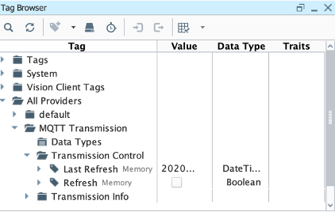
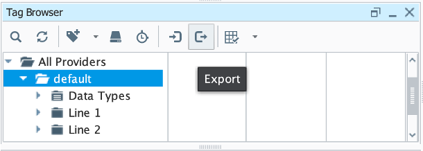

## Ignition software configuration steps

>Follow the steps below if you are using the Ignition software

#### Create Tag Hierarchy in Ignition (Physical Greenfield Only)

Represent your data in Ignition by creating a project tag hierarchy. The source of this data can be physical PLCs, or simulated devices in Ignition. 

1. Download the Ignition Designer software
2. In your browser of choice, visit the following URL: 

   `http://[hardwarePrivateIP]:8088`

3. On the top right corner of the screen, click “Get Designer”
4. Install the Ignition Designer for your operating system
5. Open the Ignition Designer and connect to your Ignition server
6. Launch the Designer
    1. Click “Add Designer” 
    2. Click “Manually Add Gateway”
    3. Add a Gateway URL in the following format: 

        `http://[reachableIgnitionIP]:8088`

    4. Under the Gateway tile you just added, click “Launch” 
7. Supply the username and password and click “Login”
    1. Username: admin
    2. Password: password
    3. If you haven’t already, it is recommended that you change your password once you’ve successfully logged into the Ignition web UI.
8. With the help of an OT professional or IMC Quick Start contact, represent your PLC data (simulated or real) in a hierarchy

#### Trigger an Sparkplug node “birth” message in Ignition

Once you are logged in to the Ignition Designer, a birth message is triggered by navigating to the tag browser, opening `tag providers`, selecting `MQTT Transmission`, then selecting `Transmission Control` and clicking the “Refresh” button.

This action triggers the IMC Quick Start’s asset model converter (AMC), which creates the models and assets that represent the Ignition hierarchy in SiteWise. 

### Asset Model Convertner (AMC) Initiation
Select the Asset Model Connverter (AMC) Driver you configured in the CloudFormation stack configuration (CF stack parameter label: `AMCDriver`) to follow the appropriate post-deployment steps:

* [AMCDriver - IgnitionCirrusLink](#amcdriver---ignitioncirruslink)
* [AMCDriver - IgnitionFileExport](#amcdriver---ignitionfileexport)

#### AMCDriver - IgnitionCirrusLink
This AMCDriver option runs automatically with the launch of the IMC Quick Start (Virtual Option). Proceed to [SiteWise Connector Activation](#sitewise-connector-activation)

#### AMCDriver - IgnitionFileExport
In this section you will export the JSON file from Ignition Server that describes your project's tag hierarchy and upload it into an S3 bucket (created during CF stack formation) to initiate the AMC workflow.

1. Access the Ignition Server Web App
    1. Open the Ignition Server UI by clicking the URL available in the output of the CloudFormation stack. The format of the URL is:
    `http://<IginitionServerPublicIP>:8088`
    2. The IgnitionServerPublicIP address is the same as the public IP address of the EC2 instance on which Ignition Server is running. The name of the EC2 instance should end with ‘/Ignition’ 
    3. Reminder: The security group of this EC2 instance is opening up the 8088 port to IP addresses in a specific CIDR block based on the “public IP address” parameter you entered during the CloudFormation stack launch.

2. Get the Ignition Designer Launcher Software
    1. Once the Ignition Web UI is open, click “sign in” in the top right corner and login with the default credentials:
    2. Username: admin
    3. Password: password
    4. It is recommended that you update the username and password from the default values immediately after login.
    5. On the top right corner of the screen, click “Get Designer”
    6. Follow the instructions to install the Ignition Designer software application for your local machine’s operating system

3. Add Ignition Gateway
    1. Open the Ignition Designer Launcher application
    2. Click “Add Designer” 
    3. Click “Manually Add Gateway”
    4. Add a Gateway URL in the following format: 
    `http://[ignition_ec2_public_ip]:8088`

4. Export tag definition JSON file
    1. In the Ignition Designer Launcher app, under the gateway tile you just added, click “Launch” 
    2. Supply the username and password (defined previously) and click “Login”
    3. In the Tag Browser, under “Tag Providers” select “default” and click export. Save this tag definition JSON file in local location you can access.

    

5. Initiate the Asset Model Converter (AMC)
    1. Upload the JSON file you just downloaded into the S3 bucket created during deployment to trigger the AMC and creation of models and assets in SiteWise. The S3 bucket will be named according to this convention:
    `[name_of_stack]-[amcincomingresource]-[hash]`
    2. Upon uploading the JSON file into this S3 bucket, an S3 event trigger will automatically invoke the AMC Lambda function to begin the automated AMC workflow.
    3. After approximately a minute (This may be longer (i.e. >5 minutes) for large, complex tag hiearchy definitions) models and assets will be provisioned within AWS IoT SiteWise.

The AMC workflow is now complete. Proceed to [SiteWise Connector Activation](#sitewise-connector-activation)

#### Accept the OPC UA Client Certificate

To enable the SiteWise to ingest data over OPC UA from Ignition’s OPC UA server, you must accept the certificate presented by the SiteWise connector within Ignition.

1. Get the private IP address of the physical hardware, and load a URL like this into your browser of choice: http://[hardwarePrivateIP]:8088
2. Once the Ignition Web UI is open, you should see a gear like icon on the left labeled `Config`. 
3. Click that, and it may ask you to log in. The default credentials are:
    1. Username: admin
    2. Password: password
    3. If you haven’t already, it is recommended that you change your password once you’ve successfully logged into the Ignition web UI.
4. Navigate to "OPC UA -> Security -> Server" and wait for the quarantined certificate to appear (from AWS IoT SiteWise Gateway). You should see a single entry under 'Quarantined Certificates' named something like 'AWS IoT SiteWise Gateway Client'.
5. Click “Trust” to accept the certificate. At this point, the SiteWise connector will start consuming data over OPC UA from Ignition and this data will be sent up to the AWS IoT SiteWise in the cloud.

### SiteWise Connector Activation
To enable the SiteWise connector running in AWS IoT Greengrass to ingest data over OPC UA from Ignition’s OPC UA server, you must accept the certificate presented by the SiteWise connector within Ignition.

1. Accept SiteWise Certificate in Ignition
    1. Open the Ignition Server UI using the URL available in the output of the CloudFormation stack. The format of the URL is: 
    `http://[IginitionServer-EC2-Instance-PublicIP]:8088`
        1. The IgnitionServerPublicIP address is the same as the public IP address of the EC2 instance on which Ignition Server is running. The name of the EC2 instance should end with ‘/Ignition’
        2. Reminder: The security group of this EC2 instance is opening up the 8088 port to IP addresses in a specific CIDR block based on the “public IP address” parameter you entered during the CloudFormation stack launch.
    2. With the Ignition Web UI open, click “sign in” in the top right corner and login with the default credentials:
        1. Username: admin
        2. Password: password
        3. It is recommended that you update the username and password from the default values immediately after login.
    3. On the left side of the Ignition Web app UI, navigate to "OPC UA" -> "Security" -> "Server". The certificate from the SiteWise connector in Greengrass should appear int he "Quarantined Certificates" section. The certificate will have the name similar to: "AWS IoT SiteWise Gateway Client".
    4. Click “Trust” to accept the certificate. At this point, the SiteWise connector will start consuming data over OPC UA from Ignition and this data will be sent up to the AWS IoT SiteWise service in the AWS cloud.

2. Update SiteWise Gateway

    1. Navigate to AWS IoT SiteWise console and in the left-hand menu select "Ingest" -> "Gateways"
    2. Select the gateway created during the stack launch. The gatweway name will follow the naming convention: 
        `[name_of_stack]_Automated_Gateway`
    3. Click “Edit” in the Source Configuration for Automated Gateway Config” section
    4. Click “Save” at the bottom. You do not need to make any changes. The action of editing and saving the configuration refreshes the SiteWise gateway and ensures data flows from the OPC UA server through the SiteWise gateway connector and into the AWS IoT SiteWise service in the AWS cloud.

### Validate the incoming data

1. Navigate to the AWS IoT Core console.
2. Select “Test” from the navbar on the left.
3. Subscribe to the MQTT topic: 

    `spBv1.0/AWS Smart Factory/DDATA/#`

4. Verify that messages are coming in on this topic.

### View SiteWise portal data

Follow the steps in the following link to view the SiteWise portal data
* [SiteWise portal data](./post-deployment.md#view-sitewise-portal-data)